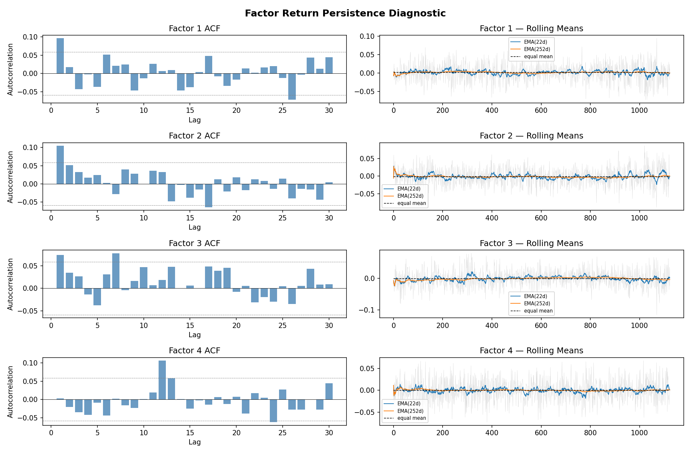
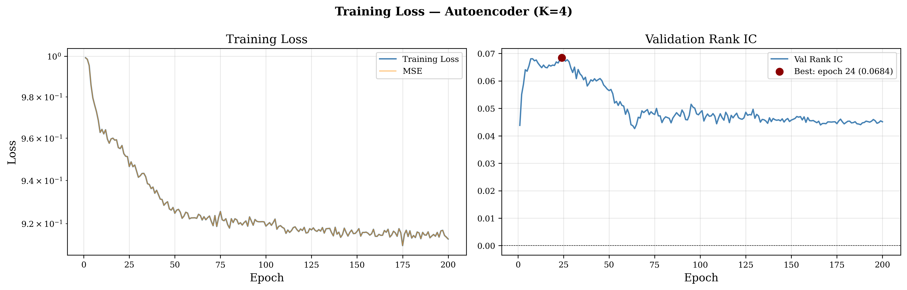
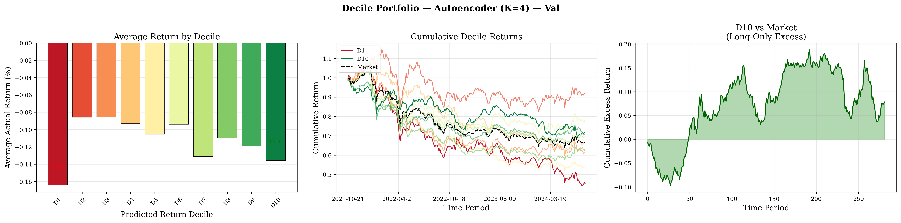
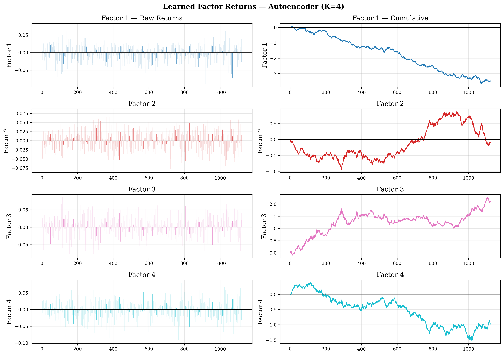
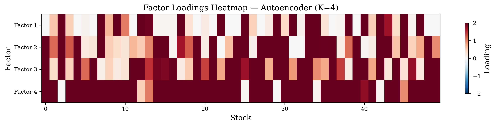
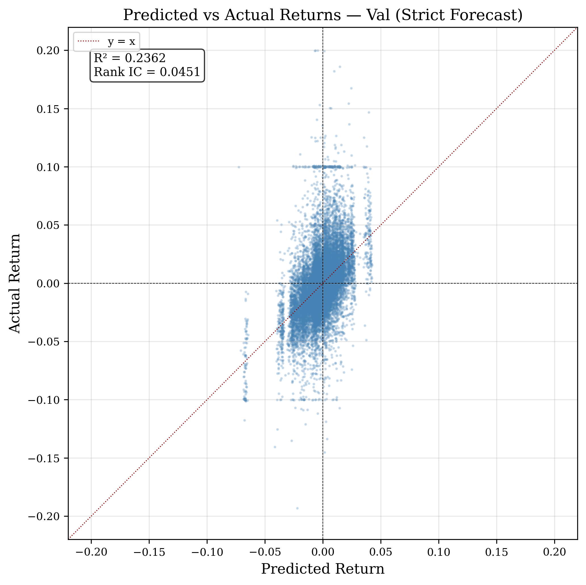
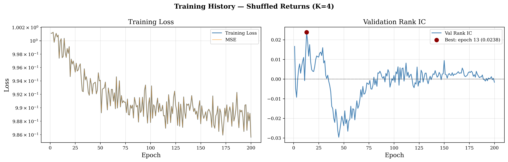
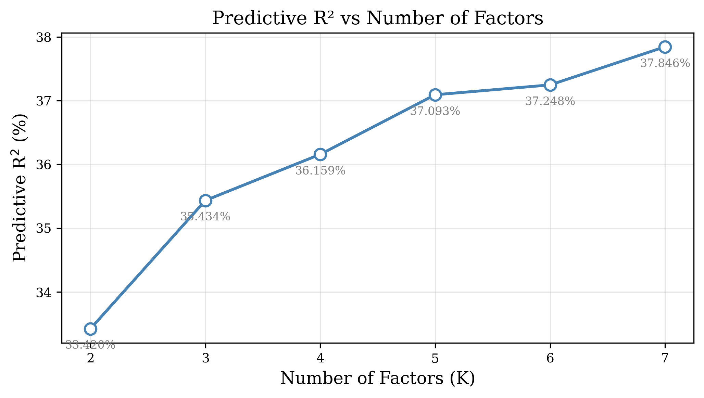
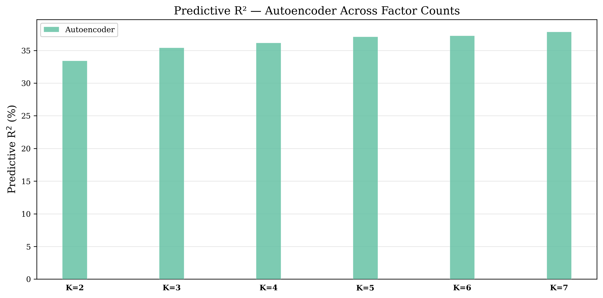
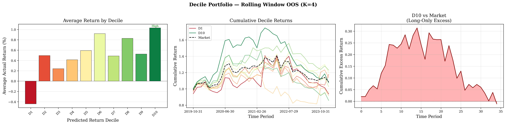

# Autoencoder 资产定价模型 — 项目文档

## 项目概述

本项目基于 **Gu, Kelly, and Xiu (2020)** "Autoencoder Asset Pricing Models"（*Journal of Econometrics*），在 A 股数据上复现自编码器资产定价模型，并对其进行严格的时间序列样本外（OOS）预测评估。项目通过 strict forecast 机制、因子收益打乱检验、多因子数对比、滚动窗口预测等实验，系统评估了模型在 A 股横截面上的预测排序能力。

**参考论文**: 
- Gu, Kelly, Xiu, "Autoencoder Asset Pricing Models", *Journal of Econometrics*, 222(1), 429-450

**数据**: A 股日频特征数据（`fire_data/`），33 维特征（默认 15 + 扩展），2015-01 至 2025-04，约 5354 只股票。

| 面板 | 时期数 | 训练集 | 验证集/测试集 |
|------|--------|--------|---------------|
| 日频 | 1406 | 1124 (80%) | Val: 282 (20%) |
| 月频 | 69 | 34 (50%) | Test: 35 (50%) |

---

## 模型架构

### 核心思想

传统资产定价模型假设因子暴露（beta）是已知特征的线性函数。Autoencoder 方法用神经网络从股票特征中**自动学习非线性因子暴露**，同时保留线性定价结构（因子模型），兼顾灵活性与可解释性。

### 架构图

```
股票特征 X_t (N × P)
       │
       ▼
┌─────────────────┐
│   Encoder        │  ← 全连接网络 [P → 32 → 16 → K]
│   BatchNorm +    │     BatchNorm + ReLU + Dropout(0.1)
│   ReLU + Dropout │     输出: Softplus (保证 beta ≥ 0)
└────────┬────────┘
         │
         ▼
    β_t (N × K)       因子暴露矩阵
         │
         ▼
┌─────────────────┐
│  Linear Decoder  │  ← R̂_t = β_t · F_t
│  (无参数)         │     F_t 为可学习的因子收益 (K,)
└────────┬────────┘
         │
         ▼
    预测收益 R̂_t (N,)
```

### 模型组件

| 组件 | 描述 | 关键参数 |
|------|------|----------|
| **Encoder** | 全连接网络，输入 P 维特征，输出 K 维因子暴露 beta | hidden_dims=[32, 16], dropout=0.1, Softplus beta≥0 |
| **Linear Decoder** | 线性定价核: R̂ = β · F，F 为每期可学习的因子收益向量 | 无参数，F_t 作为可学习参数初始化 |
| **损失函数** | MSE(R̂, R_true)，即重构误差 | — |
| **优化器** | Adam + ReduceLROnPlateau (patience=20, factor=0.5) | lr=1e-3, weight_decay=1e-5 |

### 数据构造

`prepare_panel_data(freq)` 构建 (X_t, R_{t+1}) 对: 

- **日频**: 用 `t` 日特征预测 `t+1` 日超额收益（收益已减无风险利率）
- **月频**: 用月末特征预测下一月累计超额收益
- 特征和收益分别用 `StandardScaler` 标准化

### Strict Forecast 机制

训练完成后，模型不同时期有不同的预测模式: 

| 时期类型 | 因子收益来源 | 含义 |
|----------|-------------|------|
| **训练期内** | `F_t`（训练时联合学习的该期因子） | Pricing-fit，事后解释 |
| **样本外 (OOS)** | `EMA(120)` 末值，即训练期因子收益的指数加权移动平均 | Strict forecast，无 look-ahead |

OOS 预测时绝不使用测试期真实收益，仅用训练期因子收益的 EMA(120) 最后值作为未来因子收益的最佳估计。检验发现 EMA(120)（约半年平滑）的 Val Rank IC 是简单等权均值的 2.5 倍，说明因子收益存在缓慢漂移的低频成分。

#### 因子收益持续性诊断



通过 `test.py` 对训练期的四个因子收益进行自相关检验。左列: 各因子的 ACF 图（滞后 1/5/22 天），灰色虚线为 95% 置信区间。因子日度自相关接近零（AC(1) ≈ 0.00~0.10），说明**因子收益无日度持续性**。右列: 因子收益 + EMA(22d) / EMA(252d) / 等权均值对比。EMA(120) 的 Val Rank IC 最高，说明存在缓慢低频漂移。

---

## 实验任务

### Task 1: 基线模型训练与验证 (K=4)

**目的**: 在日频数据上训练 K=4 的自编码器，对比训练集（pricing-fit）和验证集（strict forecast）上的表现。

**流程**: 
1. 用 `train_daily` 训练模型 200 epochs，每 epoch 在 `val_daily` 上计算 Rank IC
2. 对训练集和验证集分别生成预测
3. 输出训练/验证 R² 和 Rank IC

**关键输出**: 
- 训练/验证 R² 和 Rank IC 的差距 → 衡量 pricing-fit 与 strict forecast 的衰减
- 每 epoch Val Rank IC 曲线 → 诊断过拟合

#### Figure 1: Training Loss & Val Rank IC



左栏: 训练 Loss（对数坐标），右栏: 每 epoch 验证集 Rank IC。红色标记最佳 epoch。Val Rank IC 先升后稳表明训练健康，无 classic overfitting。

#### Figure 2: Decile Portfolio Performance (Val)



按预测值 z-score 标准化后分十组，计算各组实际收益均值。左栏柱状图期望从 D1 到 D10 单调递增，中栏为各组累积收益曲线，右栏为 D10 相对等权基准的超额收益。

#### Figure 3: Learned Factor Returns



四个因子在训练期内的日度收益序列。左列: 原始因子收益（柱状图），右列: 累积因子收益（折线图）。

#### Figure 4: Factor Loadings Heatmap



训练期末期 50 只股票的因子暴露热力图（红=正，蓝=负）。展示不同股票在四个因子上的暴露差异。

#### Figure 5: Predicted vs Actual Scatter (Val)



验证集预测收益 vs 真实收益散点图。预测值集中在零附近而真实收益大幅波动——说明模型不是在精确预测收益率数值，而是在做弱但有方向性的横截面排序。左上角标注该数据集的 R² 和 Rank IC。

**结果**: 

| 数据集 | R² | Rank IC |
|--------|-----|---------|
| Train (pricing-fit) | 0.3642 | 0.2809 |
| Val (strict forecast) | 0.2362 | 0.0451 |

pricing-fit → strict forecast 的衰减: R² 从 0.36 降至 0.24，Rank IC 从 0.28 降至 0.045。模型的内部解释能力较高，但严格 OOS 排序信号虽正向但偏弱。

十分位组合分析（Figure 2）显示，按预测值排序选出的前 10% 股票（D10）在验证集上跑赢等权基准，表明模型在日频 strict forecast 口径下仍能为 long-only 组合提供正向超额收益。

---

### Task 2: 收益打乱检验 (K=4)

**目的**: 检验模型信号是否来自真实的"特征→收益"关系，而非数据截面分布或训练流程的假象。

**方法**: 
1. 对每个日期内的股票收益随机排列（`shuffle_panel_returns`），破坏特征与收益的对应关系
2. 在打乱后的数据上从头训练模型
3. 对比真实模型与打乱模型在验证集上的 Rank IC

**判断标准**: 真实 Rank IC 应显著高于打乱 Rank IC。打乱后若 IC 接近零，说明原始信号真实。

#### Figure: Permutation Training History



打乱收益后模型的训练曲线。打乱后 Val Rank IC 在零附近波动，与真实数据的正 IC 形成对比。

**结果**: 

| 实验 | Val R² | Val Rank IC |
|------|--------|-------------|
| 真实数据 | 0.2362 | 0.0451 |
| 收益打乱 | 0.2365 | −0.0016 |

Rank IC 下降幅度: 0.0467。打乱后 Rank IC 降至零附近，说明原始信号来自真实的特征-收益关系，而非数据截面分布或训练流程的假象。打乱后的 R² 基本不变（因为 R² 反映的是截面分布解释力，而非排序关系）。

---

### Task 3: 因子数对比 (K=2..7)

**目的**: 系统比较不同因子数量对模型预测能力的影响。

**方法**: 对 K=2 到 7 分别训练模型，在训练集上评估 R²（in-sample pricing-fit）。

#### Figure 6: R² by Factor Count



训练集拟合 R² 随因子数 K 的变化。通常 K 越大拟合越强，但 OOS 预测力不一定随 K 单调增加。

#### Figure 7: R² Comparison Bar Chart



不同 K 值下的训练 R² 柱状对比图。

---

### Task 4: 月频滚动窗口严格 OOS 预测 (K=4)

**目的**: 最严格的预测评估——不断用新数据重训，逐月预测未来。

**方法**: 
1. 初始训练集为前 50% 月频数据
2. 每步新增一期数据后，从头训练新模型
3. 对下一月做 strict forecast（EMA(120) 因子预测）
4. 累计得到全部后 50% 时期的 OOS 预测

**评价指标**: OOS R² 和 Rank IC，十分位收益图。

#### Figure: Rolling Window OOS Decile Portfolio



月频滚动窗口的 OOS 十分位收益。这是最关键的结果图——若在月频、严格 OOS 口径下 D10 > D1 且超额为正，说明信号在经济意义上可执行。

**结果**: 

| 指标 | 值 |
|------|-----|
| OOS R² | 0.1762 |
| OOS Rank IC | 0.0405 |

月频 rolling window 的最严格评估下，Rank IC 仍为正（0.04），说明信号在较长周期、严格 OOS 口径下具备可持续的横截面排序能力。

十分位组合分析（Figure: Rolling Window OOS Decile Portfolio）显示，D10（预测值前 10%）组合在月频 OOS 测试期累计跑赢等权基准，证明模型信号在月频、严格 OOS 口径下仍能产生经济上有意义的超额收益。

---

## 结果汇总

| Task | 实验 | R² | Rank IC |
|------|------|-----|---------|
| 1 | Train (pricing-fit) | 0.3642 | 0.2809 |
| 1 | Val (strict forecast) | 0.2362 | 0.0451 |
| 2 | Shuffled Val | 0.2365 | −0.0016 |
| 4 | 月频滚动 OOS | 0.1762 | 0.0405 |

**核心结论**: 
- pricing-fit R²=0.36 说明模型有较强的截面解释力，但不能直接解释为预测能力
- strict forecast Rank IC=0.045 说明 OOS 存在正向但较弱的排序信号
- 收益打乱后 Rank IC 归零（−0.0016），验证信号真实存在
- 月频滚动 OOS 下 Rank IC=0.041，信号在更严格口径下仍持续
- Task 1 与 Task 4 的十分位组合中，D10（前 10%）均跑赢等权基准，模型信号可转化为超额收益

---

## 评估指标

| 指标 | 公式 | 含义 |
|------|------|------|
| **OOS R²** | 1 − SSR / SST | 预测收益的数值精度（通常接近 0） |
| **Rank IC** | mean(Spearman(pred, actual) over t) | 横截面排序能力，0 表示无预测力 |
| **十分位收益** | 按预测值分 10 组，计算各组实际收益均值 | 高分位组收益应 > 低分位组 |
| **Val Rank IC 曲线** | 每 epoch 验证集 Rank IC | 诊断过拟合及最佳 epoch |

---

## 核心诊断逻辑

项目不做"把模型跑完报一个漂亮数字"，而是系统性地排除各类伪信号: 

1. **pricing-fit vs strict forecast**: 训练集 R² 高不等于能预测——OOS 时的因子预测才是瓶颈
2. **收益打乱检验**: 排除数据分布或训练流程造成的假 Rank IC
3. **Rank IC 替代 R²**: 股票收益预测的目标不是精确数值，而是横截面排序
4. **月频滚动 OOS**: 最长周期、最接近真实投资场景的评估
5. **EMA 替代等权均值**: 因子收益无日度持续性，但有缓慢低频漂移，EMA(120) 最优

---

## 文件索引

| 文件 | 功能 |
|------|------|
| `Autoencoder.py` | 模型定义（Encoder/Decoder）、训练、预测、评估、滚动窗口 |
| `Data.py` | 数据加载（fire_data + 无风险利率） |
| `Plot.py` | 可视化: 训练曲线、十分位收益、因子收益、beta 热力图、R² 对比、预测 vs 真实散点图 |
| `main.py` | 主实验脚本: Task 1-4 |
| `test.py` | 因子收益自相关诊断（独立运行，不修改原代码） |
| `fire_data/` | A 股特征数据（.feather 格式） |
| `risk_free_rate/` | 无风险利率数据（国债收益率） |
| `figures/` | 输出图表 |

---

## 运行方式

```bash
# 主实验
python main.py

# 因子收益自相关诊断
python test.py
```

主实验依次执行 Task 1-4，输出图表至 `figures/task1/` 至 `figures/task4/`，终端输出各任务 R² 和 Rank IC 汇总。

---

## 已知局限

1. **未做行业/市值中性化**: 信号可能部分来自风格或行业暴露
2. **未加入执行约束**: 无涨跌停、流动性过滤、交易成本、容量限制
3. **未实现 FactorVAE**: 仅完成 Autoencoder 主线，未涉及序列动态因子模型
